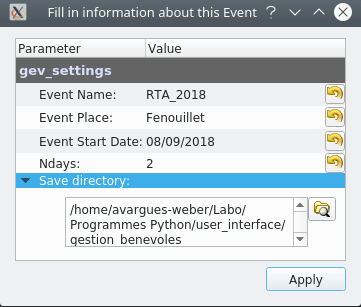

Démarrage
=========

.. contents::
   :depth: 1
   :local:
   :backlinks: none

.. highlight:: console

Au démarrage de GeVT un message apparaît pour :ref:`new_event` ou :ref:`edit_event`.

   .. _figure_start:

.. figure:: ../images/start.png
   :scale: 100 %
   :alt: Starting message
   :align: center

   Message de démarrage de GeVT
   
   
   .. _new_event:
   
Créer un nouvel événement
-------------------------

Un événement consiste principalement en une date de début et un nombre de jours durant lequel a lieu l'événement. 

   .. _figure_edit:
   

   
   Configuration d'un événement
   
La :numref:`figure_edit` présente les 5 champs configurable d'un événement\:

* **Event Name**: nom de l'événement. c'est aussi le nom du fichier de sauvegarde.
* **Event Place**: lieu de l'événement
* **Event Start Date**: date de début de l'événement
* **Ndays**: Nombre de jour durant lequel a lieu l'événement
* **Save directory**: emplacement de la sauvegarde.

Ces différents champs peuvent être modifié ensuite dans le menu *Settings*. Ceci dit, ce n'est pas vraiment recommandé car cela peut induire de nombreux bugs non encore traité... Il vaut donc mieux recommencé avec un nouveau fichier.

Remplir un événement
--------------------   

Un événement nouvellement créé est vide. Il ne contient aucune liste de tâches à effectuer
ni de volontaires pour y être affecté (voir :numref:`figure_empty_tables`).

   .. _figure_empty_tables:
   
.. figure:: ../images/empty_tables.png
   :scale: 80 %
   :alt: emtpy
   :align: center
   
   Création d'un nouvel événement vide de tâches et de volontaires
   

Tout événement est sauvegardé sous la forme d'un fichier hdf5 ayant l'extension
*\*.gev*. Ce fichier contient principalement deux tables, une pour la liste des
tâches définies et une pour la liste des bénévoles (volontaires).

Il faut donc remplir ces tables!

