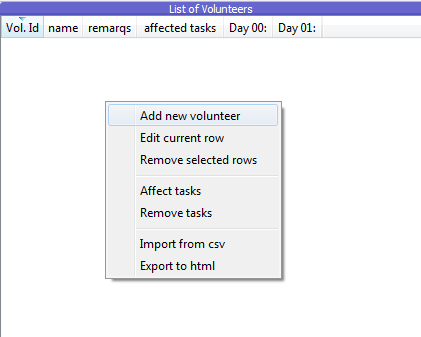
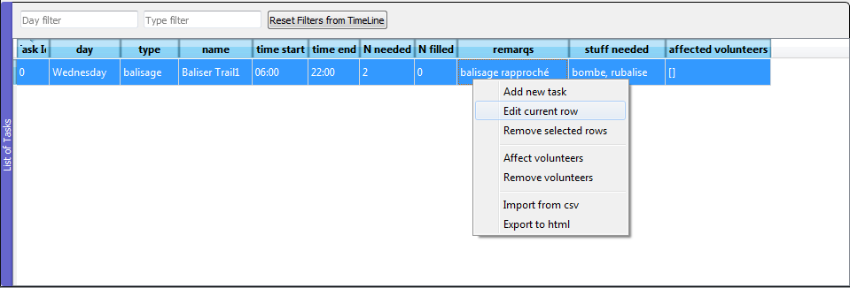

Édition
=======

.. contents::
   :depth: 1
   :local:
   :backlinks: none

.. highlight:: console

Edition manuelle
----------------

Pour remplir l'une ou l'autre des tables il suffit de positionner la souris dessus et de
faire un clic droit. Un menu contextuel apparait alors, tel que visible
sur la :numref:`figure_edit_volunteers` et sur la :numref:`figure_edit_task`.

   .. _figure_edit_volunteers:

   Edition (clic droit) de la table des bénévoles

   .. _figure_edit_task:

   Edition (clic droit) de la table des tâches

Sur ces menu on a le même genre de champs:

* Add new task (or volunteer): ouvre un menu contextuel pour remplir l'ensemble des champs nécessaires
* Edit current row: édition d'une ligne existante (même effet en double cliquant sur une ligne existante)
* Remove selected rows: enlève les lignes sélectionnées (attention!)
* Affect volunteers (or task): c'est ici qu'on affecte les bénévoles disponibles sur une tâche donnée
  ou des tâches (non complètes) à un bénévole donné
* Remove volunteers (or task): pour enlever une tâche attribuée à un bénévole (ou enlever un bénévole à une tâche)
* Import from csv: remplissage des tableaux à partir d'un fichier csv (voir :ref:`importation`)
* Export to html: exporte la liste des tâches dans un fichier html pour impression... mais plus important
  exporte pour chaque bénévole sa fiche de poste contenant les tâches qu'il doit effectuer.

.. _importation:

Importation fichier CSV
-----------------------

Pour se simplifier la vie, il est possible d'importer tout un fichier csv contenant les valeurs pré-remplies
des différents champs de la table. Le dossier ``examples`` de *gevt* contient deux fichiers csv
type pouvant être réutilisé comme template.

